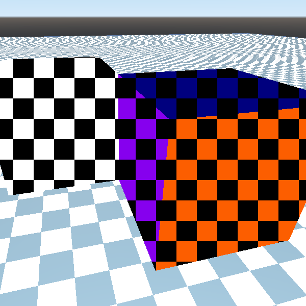

# Spatial Screen Space Texturing
A Godot shader that renders a tileable 2D texture to screen, using spatial polygons as a mask.

Thanks Shifty for the naming help. ;)

See more of my shaders (eventually) here: https://godotshaders.com/author/deertears/
